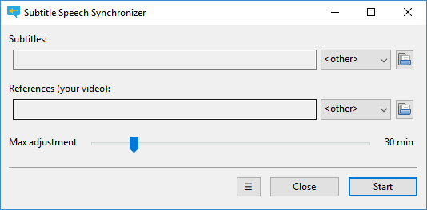
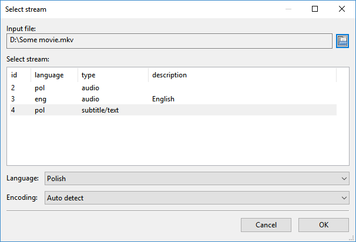

This is an automatic movie subtitle synchronization tool.
Synchronization is done by listening to the audio track, translating it if necessary.

## Features
* subtitle synchronization with audio track
* subtitle synchronization with another subtitles
* support for different languages for subtitles and reference track (using dictionary)
* easy to use graphical interface
* support for drag & drop
* auto update

## Download
All versions could be download from [GitHub release page](https://github.com/sc0ty/subsync/releases).

### Windows installer
* [subsync-0.4.0-amd64.msi](https://github.com/sc0ty/subsync/releases/download/0.4/subsync-0.4.0-amd64.msi)
(you need also [Microsoft Visual C++ 2015 Redistributable](https://www.microsoft.com/en-us/download/details.aspx?id=53587) if you dont have it already)

### Source code
* [Source code (zip)](https://github.com/sc0ty/subsync/archive/0.4.zip)
* [Source code (tar.gz)](https://github.com/sc0ty/subsync/archive/0.4.tar.gz)

## Screenshots

